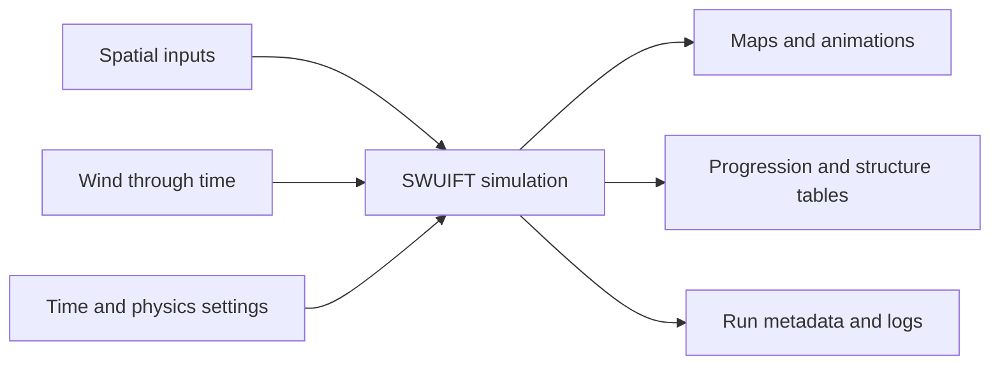

# SWUIFT

**Simulating Wildfire–Urban Interface Fire Transmission**

SWUIFT is a research simulator for studying how vegetation fire, wind-driven
firebrands, radiant heat, and structure hardening interact across a gridded
wildland–urban interface. Use the desktop application for an interactive
workflow or the command-line interface (CLI) for scripted and batch runs.

!!! warning "Research software"
    SWUIFT is not an operational forecasting, evacuation, emergency-response,
    or life-safety system. Results depend on input quality and model
    assumptions and require expert interpretation.

## Choose a workflow

=== "Desktop"

    1. [Download and verify](downloads.md) the build for your platform.
    2. Follow the [installation guide](installation.md).
    3. Select the ten required inputs, configure time and outputs, and add the
       run to the queue.
    4. Use [Quick Start](quick-start.md) and the [GUI guide](gui.md).

=== "Command line"

    1. Install Python 3.10 or newer.
    2. Install the source checkout in an isolated environment.
    3. Run `swuift --help`.
    4. Follow the [CLI guide](cli.md) or [Marshall tutorial](marshall-tutorial.md).

## Model workflow

SWUIFT uses fixed-duration timesteps. A start and end time are inclusive, so a
ten-hour window at five-minute spacing contains **121 states**: the initial
state plus 120 transitions.

## Documentation map

- [Downloads](downloads.md): immutable release links and release metadata.
- [Input schema](input-schema.md): required arrays, variables, shapes, and formats.
- [Expected outputs](outputs.md): files created by desktop and CLI runs.
- [Verification](verification.md): SHA-256 and signature checks.
- [Citation, DOI, and license](citation-license.md): reuse and attribution terms.
- [Troubleshooting and contact](troubleshooting.md): common errors and support.

!!! info "Publication placeholders"
    Repository, release, DOI, checksum, and signing-key values marked
    **FUTURE PUBLICATION VALUE** must be replaced by the maintainers before the
    first public release. They are deliberately not invented in this site.
